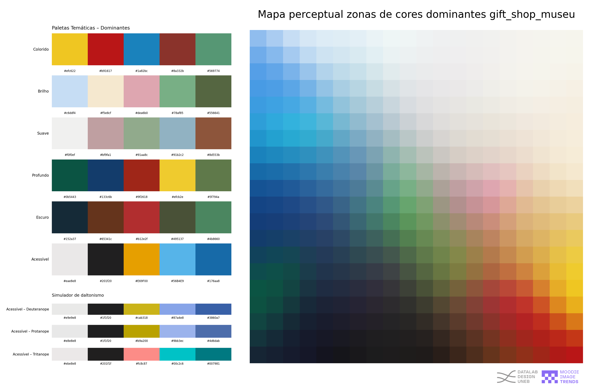
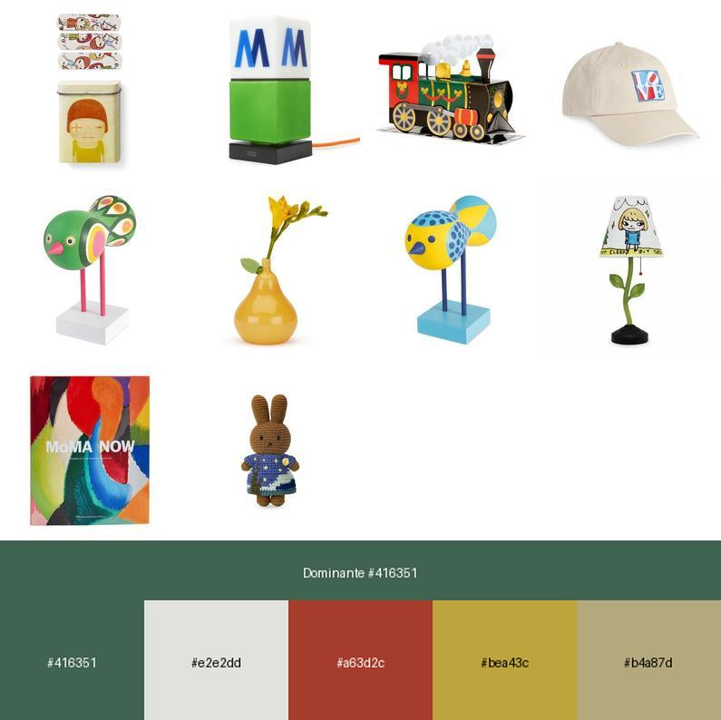
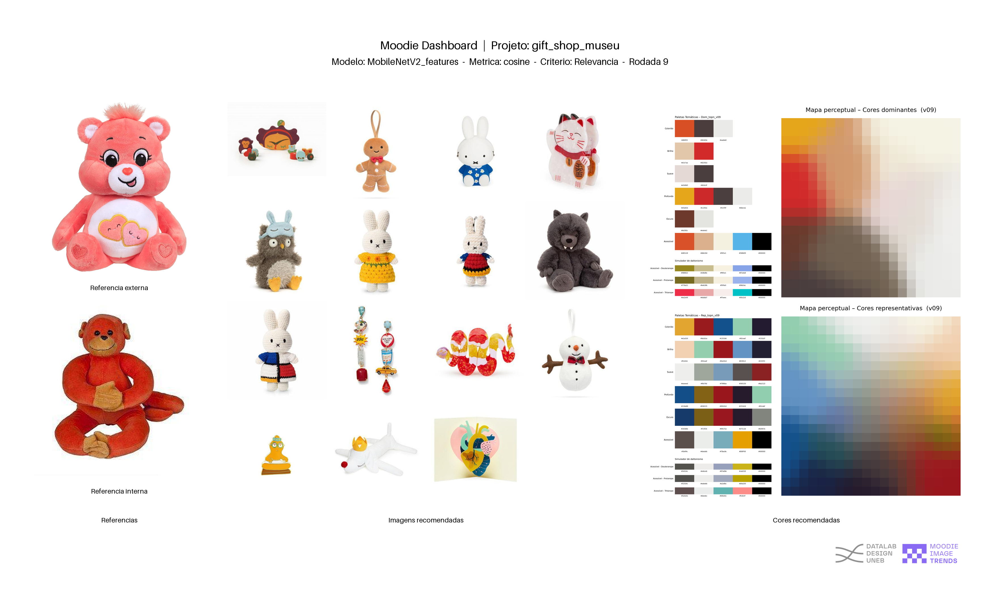

# MOODIE Image Trends &nbsp;·&nbsp; Módulo de análise de tendências
> **Uma trilha de aprendizado visual para quem ainda não programa.**

MOODIE Image Trends é um _notebook_ que transforma **uma coleção de imagens** num
conjunto de **painéis, paletas e recomendações** prontas para análise de tendências. 

Ele foi pensado para disciplinas de **Pesquisa Visual**, **Design de Moda**,
**UX Research** e **Semiótica** onde o aluno pode tirar proveito de técnicas avançadas de IA integradas em processos de design **sem precisar escrever código**.

MOODIE Image Trends_ é um notebook interativo para Google Colab que transforma **uma coleção de imagens** num
conjunto de **painéis, paletas e recomendações** prontas para análise de tendências. 

Inicialmente concebido como ferramenta pedagógica para as disciplinas de Introdução aos métodos digitais aplicados ao design e visualização de dados do curso de design da UNEB, o objetivo é permitir que estudantes de Design explorem de forma prática processos de exploração em Moda, editorial, UX Research e metodologia projetual, integrando conceitos de machine learning, vetores e modelos de visão computacional, sem a necessidade de codificação. Pesquisadores interessados em mapear padrões visuais ou detectar tendências em grandes acervos também encontrarão nele um ponto de partida para análises mais aprofundadas.

---

## ✦ Funcionalidades principais

- **Amostragem inteligente**  
  - *Downsample, Upsample* ou amostra aleatória, mesmo quando não há CSV.
- **Extração de *features* visuais**  
  - Modelos pré‑treinados **VGG16, ResNet50, MobileNetV2, InceptionV3**.
- **Remoção de duplicatas**  
  - Combina **hash MD5, pHash** e análise de **embeddings**.
- **Mapas perceptuais & paletas**  
  - Agrupamento cromático em LAB → paletas *Colorido, Brilho, Suave, Profundo, Escuro* e **Acessível** (simulação de daltonismo protano‑/deuterano‑/tritanopia).
- **Image‑walls**  
  - Mosaicos ordenados por similaridade, cor dominante, ranking ou representatividade.
- **Sistema de recomendação**  
  - Busca Top N por **Cosseno, Euclidiana ou Correlação**, com pesos ajustáveis para embeddings e colunas extras (média, mediana, Jaccard).  
  - Aceita **imagem interna** ou **upload externo** como referência.
- **Dashboards automáticos**  
  - Resumo visual (referência + wall + mapas de cor) pronto para apresentação.  
- **Exportação ZIP**  
  - Todos os painéis, CSVs e imagens recomendadas em um clique.

---

## ✦ Requisitos rápidos

Este módulo roda direto no **Google Colab** — nenhuma instalação local necessária.  
Bibliotecas extras são instaladas automaticamente pelo notebook ( `tensorflow`, `distinctipy`, `umap-learn`, etc.).

- Python ≥ 3.9 (padrão Colab)  
- `pandas`, `numpy`, `Pillow`, `ipywidgets`, `scipy`, `scikit‑learn`  
- GPU opcional em Colab para acelerar a extração de *features*

## O que você precisa

* uma pasta ou arquivo zip  com as imagens que vc quer examinar (.jpg/.png).  
* um arquivo CSV contendo metadados e outras informações complementares sobre suas imagens (opcional)
* Conta Google → abra o notebook no **Google Colab** e rode célula por célula.

_você pode usar os dados que obteve no módulo grabber do moodie_

## 1. Visão geral do fluxo

## 1. Visão geral do fluxo

| Etapa | O que entra | O que acontece | O que sai | Usos Potenciais (O que permite fazer) |
|-------|-------------|---------------|-----------|---------------------------------------|
| 1. Importação | • Pasta **`imagens/`** • (Opcional) arquivo **CSV** com metadados | Notebook carrega imagens; se houver CSV, ele associa cada linha à imagem pelo nome do arquivo. | `global_df` (DataFrame) com pelo menos a coluna de nome da imagem e quaisquer colunas extras do CSV | Organizar e catalogar coleções visuais, associar informações textuais (metadados) às imagens para análise posterior. |
| 2. Extração de *features* | `global_df` + escolha do modelo | Cada imagem é codificada num vetor numérico (embedding). | Nova coluna `…_features` anexada ao `global_df` | Transformar imagens em dados numéricos comparáveis para análise visual, identificar semelhanças visuais de forma automatizada. |
| 3. Remoção de duplicatas | `global_df` com embeddings | Algoritmo greedy identifica: 1) arquivos idênticos, 2) imagens quase‑iguais (pHash) e 3) embeddings muito próximos; move cópias p/ subpasta e grava CSVs. | • **dataset_no_duplicates.csv** • **dataset_duplicates.csv** • 3 image‑walls (full / sem dups / apenas dups) | Limpar bases de dados visuais de redundâncias, otimizar análises focando em conteúdo único, identificar e analisar variações sutis entre imagens quase idênticas. |
| 4. Mapas perceptuais & paletas | `global_df` (sem duplicatas) | Agrupa cores dominantes & representativas ➀, cria mapa perceptual, extrai paletas temáticas e versões acessíveis (WCAG + simulação de daltonismo). | PNGs dos mapas, paletas temáticas e acessíveis + CSV com células de cor | Visualizar a distribuição de cores em um conjunto de imagens, identificar paletas de cores predominantes e temáticas, gerar paletas acessíveis para design inclusivo. |
| 5. Imagewalls | DataFrame filtrado (por ranking, cor, representatividade ②, etc.) | Constrói mural (thumbs ordenados), opcionalmente gera paleta resumida no rodapé. | JPEG da wall + CSVs de **wall_info** & **images_info** além de relatórios e csvs com detalhes sobre os metadados associados às imagens presentes na imagewall| Criar visualizações gerais ou sínteses visuais do corpus com base em critérios específicos (similaridade visual, cores, metadados como preço, engajamento etc.), gerar referências visuais para projetos de design. |
| 6. Recomendação | Embeddings + colunas extra + parâmetros de usuário | Calcula similaridade (cosseno/ euclidiana/ correlação); combina pesos; devolve Top‑N, gera wall + dashboards de cor + dashboard‑síntese; empacota tudo em ZIP. | • imagewall_topN.png • dashboards_dom / rep • dashboard_resumo.png • CSVs com detalhamento descritivo recomendações | Explorar tendências e mapear padrões visuais combinando algoritmos de recomendação customizáveis com parâmetros do usuário e técnicas avançadas de visão computacional. Descobrir imagens visualmente semelhantes dentro de um conjunto de dados, gerar recomendações visuais personalizadas com base em preferências ou critérios definidos, criar mood boards dinâmicos e exploratórios. |

➀ **Método**: k‑means ponderado pela frequência das cores → clustering em LAB → cada célula exibida em grade 20×20.

② **Método**: o critério de representatividade seleciona as imagens que mais se aproximam da média do centróide do grupo (caso usuário opte por agrupar por algum critério) ou do corpus.

---

## 2. Módulos detalhados

### 2.1 Amostragem (Sample Dataset)
> **Objetivo**  
> Criar um subconjunto representativo (ou balanceado) do corpus – seja via downsizing, upsizing ou amostra aleatória – permitindo prototipagem rápida e controle do número de imagens processadas.

*Uso opcional* — permite selecionar subconjuntos amostrais por aleatoriedade. Se você tem um dataset com csv, a interface irá te oferecer algumas opções de amostragem. Se você possui apenas um conjunto de imagens, a interface detecta automaticamente e permite apenas que vc informe o total de imagens que vc deseja na sua amostra final.

| Entrada | Método | Indicado quando |
|---|---|---|
| CSV | Downsample | Utilize para reduzir o tamanho do dataset, mantendo a proporção entre as categorias (se especificada). Útil quando o dataset é muito grande e você deseja uma amostra menor para prototipagem ou análise exploratória sem perder a representatividade das classes majoritárias. |
| CSV | Upsample | Utilize para aumentar o tamanho de categorias minoritárias, replicando amostras existentes. Útil para balancear datasets desequilibrados, onde algumas categorias têm muito menos exemplos que outras, o que pode prejudicar o treinamento de modelos de *machine learning*. |
| CSV/IMAGEM | Random Sample | Utilize para selecionar um número aleatório de amostras do dataset inteiro, sem considerar as categorias. Útil para obter uma visão geral rápida do dataset ou quando as categorias não são relevantes para a amostragem. Se estiver usando apenas imagens, esta é a única opção disponível para criar um subconjunto aleatório. |

### 2.2 Extração de Características Visuais das Imagens
> **Objetivo**  
> Converter cada imagem em um vetor numérico (embedding) usando modelos CNN pré‑treinados, fornecendo a base matemática para todas as comparações de similaridade visual.

O Moodie utiliza modelos de inteligência artificial pré-treinados para "ler" suas imagens e transformá-las em representações numéricas, chamadas de "características visuais" (ou *features*). Pense nisso como se cada imagem ganhasse um código secreto que descreve o que ela contém visualmente.

**Por que isso é importante?**

Essa etapa permite que o Moodie compare e encontre similaridades entre as imagens de uma maneira que um computador consegue entender. É a base para todas as análises visuais que você poderá fazer, como encontrar imagens parecidas, agrupar imagens por estilo, e identificar tendências visuais.

**Como funciona?**

1.  **Escolha do Modelo:** O Moodie oferece uma lista de modelos pré-treinados (como os mostrados na tabela abaixo). Cada modelo é como um especialista em identificar diferentes tipos de informações visuais. Você pode escolher um ou mais modelos para analisar suas imagens.
2.  **"Leitura" das Imagens:** O Moodie pega cada uma de suas imagens e a passa pelo modelo escolhido. O modelo realiza uma série de operações para identificar padrões visuais (formas, cores, texturas, objetos, etc.).
3.  **Criação do "Código Visual":** Para cada imagem, o modelo gera um "código" numérico (o *embedding* ou vetor de características) que resume o que ele "viu".
4.  **Armazenamento:** Esse "código visual" é guardado em uma nova coluna na sua tabela de dados, chamada `Modelo_features`.

**Dicas importantes:**

* **Processamento:** Essa etapa pode levar algum tempo, especialmente com muitas imagens. Se você não tem um computador potente, comece com uma amostra menor (por exemplo, 100-200 imagens) para testar e entender qual modelo funciona melhor para o seu projeto. Depois, você pode rodar a análise no seu dataset completo.
* **Escolha do Modelo:** A tabela abaixo descreve brevemente para que tipo de análise cada modelo pode ser mais adequado. Experimentar diferentes modelos pode trazer resultados interessantes!

| Modelo | Foco Principal | Bom para identificar… |
|---|---|---|
| **VGG16** (padrão) | Texturas e cor global | Aparência geral das cores e texturas predominantes nas imagens. |
| **ResNet50** | Formas complexas e objetos | Formas de objetos, detalhes de produtos e estruturas visuais mais complexas. |
| **MobileNetV2** | Texturas e cor global (rápido) | Análise rápida de cores e texturas, ideal para grandes coleções e testes iniciais. |
| **InceptionV3** | Variação de escala e detalhes | Detalhes finos e objetos em diferentes tamanhos dentro da mesma imagem. |

Ao final dessa etapa, suas imagens estarão representadas numericamente, prontas para serem exploradas e analisadas visualmente com as outras ferramentas do Moodie!

---

### 2.3 Remoção de Duplicatas Visuais
> **Objetivo**  
> Detectar e separar cópias exatas ou quase idênticas (hash, pHash e embedding) para manter somente imagens únicas e evitar viés nas análises seguintes.

Depois de extrair as características visuais das suas imagens, o Moodie pode identificar e remover automaticamente imagens duplicadas ou muito semelhantes em sua coleção. Isso é útil para limpar seu dataset, evitar redundâncias nas análises futuras e garantir que as tendências visuais identificadas sejam representativas de imagens únicas.

**Como o Moodie identifica duplicatas?**

O Moodie utiliza três métodos inteligentes para encontrar duplicatas, verificando diferentes níveis de semelhança:

1.  **Cópias Exatas (Hash MD5):** Procura por arquivos que são idênticos byte a byte. É como verificar se dois arquivos são exatamente a mesma cópia.
2.  **Cópias Quase Iguais (pHash):** Identifica imagens que são muito parecidas visualmente, mesmo que tenham pequenas diferenças (como compressão ou pequenas edições). Pense nisso como encontrar fotos quase idênticas, mas com pequenas variações.
3.  **Semelhança Visual Profunda (Embedding):** Utiliza os "códigos visuais" (embeddings) extraídos na etapa anterior para encontrar imagens que são visualmente muito semelhantes em um nível mais profundo, mesmo que não sejam cópias exatas ou quase exatas. Se você usou mais de um modelo, é recomendado que vc remova as duplicatas usando o mesmo modelo que irá prosseguir com as análises

**O que acontece durante a remoção?**

* **Seleção da "Âncora":** Para cada grupo de imagens duplicadas, o Moodie escolhe a primeira imagem que encontrou como a "âncora" (a imagem que será mantida).
* **Movimento das Duplicatas:** As cópias identificadas são movidas automaticamente para uma pasta chamada `duplicatas` dentro da sua pasta de `imagens/`. Isso mantém seu conjunto de dados principal limpo, mas você ainda tem acesso às duplicatas, caso precise revisá-las.
* **Acompanhamento do Processo:** Enquanto o Moodie trabalha, você verá barras de progresso mostrando o andamento da análise.
* **Resultado Final:** Ao final do processo, um botão **Baixar ZIP** aparecerá. Ao clicar, você baixará um arquivo compactado (.zip) contendo:
    * Um dataset "limpo" (sem as duplicatas removidas).
    * Um registro das duplicatas que foram encontradas.
    * Paredes de imagens (image walls) mostrando:
        * Todas as imagens do seu conjunto inicial.
        * Apenas as imagens únicas (após a remoção das duplicatas).
        * A coleção de imagens que foram identificadas como duplicatas.

**Por que remover duplicatas?**

* **Análises mais precisas:** Garante que as tendências visuais e os resultados das análises futuras não sejam distorcidos por múltiplas cópias da mesma imagem.
* **Economia de espaço:** Ajuda a reduzir o tamanho da sua coleção de imagens, facilitando o gerenciamento e o processamento.
* **Melhor organização:** Mantém seu conjunto de dados principal mais organizado e focado em imagens únicas.

Ao utilizar a remoção de duplicatas do Moodie, você garante uma base de dados visual mais limpa e confiável para suas explorações e análises de tendências!

---

### 2.4 Análise de Cores e Geração de Paletas
> **Objetivo**  
> Mapear a distribuição cromática do corpus, agrupar cores em “zonas” perceptuais e gerar paletas temáticas / acessíveis que resumem a identidade visual do conjunto.

Esta etapa do Moodie mergulha nas cores do seu conjunto de imagens para criar um mapa visual da distribuição de cores predominantes e sugerir paletas temáticas relevantes para o seu corpus.

**Mapa Perceptual de Cores:**

Imagine um mapa onde cada ponto representa uma cor presente no seu conjunto de imagens. Cores semelhantes visualmente ficam próximas umas das outras, criando "regiões" de cores predominantes. O Moodie gera esse mapa perceptual combinando as cores de todas as suas imagens e aplicando um algoritmo que agrupa cores semelhantes espacialmente. A intensidade da cor em certas áreas do mapa indica a concentração dessas tonalidades no seu corpus.

**Exemplo Visual:**

*Este mapa mostra como as cores estão distribuídas no seu conjunto de imagens. Áreas com cores vibrantes indicam uma maior ocorrência dessas tonalidades.*

**Como o Moodie encontra as "zonas" de cor?**

O Moodie utiliza conceitos da **teoria das cores** para identificar regiões significativas no mapa perceptual. Ele se baseia na ideia do **círculo cromático**, onde as cores estão dispostas em um ciclo baseado em suas relações de matiz.

1.  **Divisão por Matiz:** O Moodie divide o espectro de cores em 24 faixas de matiz (cada uma com 15 graus no círculo cromático), atribuindo um nome a cada faixa (por exemplo, Vermelho, Laranja, Amarelo, Verde, Azul, Violeta).
2.  **Agrupamento por Proximidade:** No mapa perceptual, cores com matizes semelhantes e próximas espacialmente tendem a se agrupar. O algoritmo identifica esses agrupamentos como "zonas" de cor predominantes no seu corpus.
3.  **Análise Estatística:** Para cada "zona", o Moodie calcula a média das tonalidades presentes para determinar a cor representativa daquela região.

**Paletas Temáticas:**

Além do mapa, o Moodie extrai paletas de cores temáticas, sugerindo conjuntos de 5 cores que podem ser relevantes ou representativas do seu corpus sob diferentes perspectivas.

**Lógica e Métricas das Paletas Temáticas:**

A escolha das cores para cada paleta temática se baseia em uma combinação da distribuição de cores no mapa perceptual e em métricas que avaliam as características das cores dentro de cada "zona". A lógica geral é identificar cores distintas e representativas de diferentes áreas do mapa, priorizando aquelas que melhor se encaixam na "temática" da paleta.

| Tema da Paleta | Lógica Principal | Métricas Utilizadas |
|---|---|---|
| **Colorido** | Prioriza cores com alta saturação e luminosidade intermediária, buscando variedade e vivacidade. | Saturação (alta), Luminosidade (próxima de 0.5), Distância de cor entre as amostras. |
| **Brilho** | Seleciona cores claras e saturadas, evocando energia e destaque. | Luminosidade (alta), Saturação (alta). |
| **Suave** | Escolhe cores claras e com baixa saturação (tons pastel), transmitindo delicadeza e calma. | Luminosidade (alta), Saturação (baixa). |
| **Profundo** | Opta por cores escuras e saturadas, sugerindo intensidade e mistério. | Luminosidade (baixa), Saturação (alta). |
| **Escuro** | Foca em cores predominantemente escuras, com alguma saturação para evitar tons puramente acromáticos. | Luminosidade (baixa), Saturação (moderada a alta), Peso da frequência de cores escuras. |
| **Acessível** | Seleciona cores que são distinguíveis para pessoas com diferentes tipos de daltonismo (protanopia, deuteranopia, tritanopia). | Distância de cor (Delta E) simulada para diferentes tipos de daltonismo (mínimo de contraste seguro). |

Para a paleta "Acessível", o Moodie tenta selecionar uma cor representativa de cada uma das 5 "zonas" de cor identificadas, garantindo que as cores escolhidas tenham contraste suficiente para serem distinguidas por pessoas com daltonismo. Se não for possível encontrar 5 cores distintas e seguras, a paleta pode conter menos cores, com um aviso indicando isso.

**Renomeando Imagens:**

O Moodie oferece a opção de renomear seus arquivos de imagem com base em diferentes critérios extraídos durante a análise:

| Critério de Renomeação | Descrição | Útil para… |
|---|---|---|
| **Não renomear** | Mantém os nomes de arquivo originais. | Quando você já possui uma convenção de nomenclatura estabelecida ou não deseja alterar os nomes dos arquivos. |
| **Renomear por HEX** | Renomeia os arquivos com o código hexadecimal da cor dominante detectada na imagem. | Organizar visualmente as imagens por sua cor principal. |
| **Renomear por pHash** | Renomeia os arquivos com o valor do pHash (perceptual hash) da imagem. O pHash gera uma "impressão digital" visual da imagem, útil para identificar duplicatas aproximadas. | Agrupar imagens visualmente semelhantes (mesmo com pequenas alterações). |

**Metadados EXIF:**

EXIF (Exchangeable Image File Format) são metadados incorporados em arquivos de imagem pela maioria das câmeras digitais e smartphones. Se presentes nas suas imagens, o Moodie pode extrair diversas informações úteis:

* **Data e Hora da Captura:** Quando a foto foi tirada.
* **Modelo da Câmera/Celular:** O dispositivo utilizado para capturar a imagem.
* **Configurações da Câmera:** ISO, abertura, velocidade do obturador, distância focal.
* **Informações de Lente:** Modelo da lente utilizada.
* **Dados de GPS:** Coordenadas geográficas de onde a foto foi tirada (latitude e longitude).

Esses metadados podem ser valiosos para análises contextuais e para entender a origem das suas imagens. O Moodie verifica a presença dessas informações e as disponibiliza para você explorar em seus dados.

---

### 2.5 Visualização do Corpus
> **Objetivo**  
> Construir “image‑walls” ordenadas (geral ou por grupos) que permitem inspeção visual rápida, revelando padrões, duplicidades e a coerência estética do dataset.

Esta etapa do Moodie permite criar representações visuais do seu conjunto de imagens, facilitando a exploração e a identificação de padrões. Você pode gerar "paredes de imagens" (imagewalls) que organizam suas fotos em uma grade, com opções para filtrar, agrupar e exibir informações relevantes.

**O que você pode fazer?**

* **Visualização Geral:** Criar uma visão geral de todas as imagens do seu corpus em uma única grade.
* **Agrupamento Visual:** Organizar as imagens em paredes separadas com base em categorias ou características específicas (por exemplo, por cor dominante, por similaridade visual - se você executou a etapa de clusterização).
* **Filtragem:** Exibir apenas um subconjunto das imagens com base em critérios como representatividade (as imagens mais típicas de um grupo), ranking (se você tiver dados de classificação associados às imagens) ou cor dominante.
* **Exibição de Paletas de Cores:** Incluir automaticamente a paleta de cores dominante de cada grupo de imagens diretamente na parede visual.
* **Eliminação de Duplicatas (Opcional):** Antes de gerar as visualizações, você pode optar por remover imagens duplicadas ou muito semelhantes para obter uma representação mais limpa do seu corpus único.

**Como funciona?**

1.  **Seleção da Coluna de Imagens:** Primeiro, você informa ao Moodie qual coluna da sua tabela de dados contém os nomes dos arquivos de imagem.
2.  **Opções de Agrupamento (Opcional):** Se desejar, você pode escolher uma coluna para agrupar suas imagens. O Moodie criará uma parede de imagens separada para cada grupo único nessa coluna. Por exemplo, se você tiver uma coluna "Estilo", poderá visualizar uma parede para cada estilo diferente.
3.  **Opções de Filtragem (Opcional):**
    * **Nenhum:** Exibe todas as imagens (após a remoção de duplicatas, se selecionado).
    * **Representatividade:** Para cada grupo (ou para todo o corpus, se não houver agrupamento), o Moodie identifica as imagens que são mais representativas visualmente, com base nas características extraídas anteriormente. Você pode definir quantas imagens "Top N" deseja visualizar por grupo.
    * **Ranking:** Se você tiver uma coluna com valores de ranking (por exemplo, pontuações de popularidade), pode usar essa opção para exibir as imagens com os maiores ou menores rankings (Top N). Você precisa selecionar a coluna de ranking e a ordem (crescente ou decrescente).
    * **Cor Dominante:** Permite exibir as imagens com as cores dominantes mais claras ou mais escuras (Top N), com base na coluna de cor dominante extraída na etapa anterior.
4.  **Tamanho dos Miniaturas:** Você pode definir a largura e a altura desejadas para as miniaturas das imagens na parede visual. O Moodie ajustará automaticamente o layout para acomodar o número de imagens.
5.  **Recorte (Opcional):** A opção "Crop (Quadrado)" instrui o Moodie a recortar as imagens para um formato quadrado antes de redimensioná-las para as miniaturas, garantindo uma grade visualmente uniforme.
6.  **Paletas de Cores (Opcional):** Você pode escolher se deseja incluir uma faixa com a cor dominante e uma pequena paleta de cores representativas abaixo de cada parede de imagens (para a visualização geral e/ou para cada grupo).
7.  **Eliminação de Duplicatas (Opcional):** Ao marcar essa caixa, o Moodie realizará uma verificação para remover imagens que são cópias exatas, quase idênticas (visualmente muito semelhantes) ou muito próximas em termos de suas características visuais (embeddings). **Se você já executou a etapa de remoção de duplicatas anteriormente, não é necessário marcar esta opção novamente.**

**Como o Moodie lida com a eliminação de duplicatas?**

Se você optar por eliminar duplicatas, o Moodie aplica uma série de verificações:

1.  **Duplicatas Exatas (Hash MD5):** Ele compara um "código" único gerado a partir do conteúdo de cada arquivo. Se os códigos forem idênticos, os arquivos são considerados cópias exatas.
2.  **Duplicatas Quase Iguais (pHash):** Ele usa um algoritmo chamado "perceptual hash" (pHash) que cria uma "impressão digital" visual da imagem. Imagens com pHashes muito semelhantes (uma diferença de até 4 bits) são consideradas cópias quase idênticas.
3.  **Duplicatas por Características Visuais (Opcional):** Se você já extraiu as características visuais das imagens, o Moodie pode comparar esses "códigos visuais". Imagens com códigos muito próximos (uma similaridade de cosseno muito alta) são consideradas visualmente muito semelhantes.

O Moodie mantém a primeira imagem encontrada de cada grupo de duplicatas e remove as demais antes de gerar as paredes visuais. Um resumo do número de duplicatas removidas por cada método é exibido.

**Resultado:**

Ao final do processo, o Moodie gerará uma ou mais imagens (arquivos `.jpg`) contendo as paredes visuais do seu corpus (geral e/ou por grupos), salvas em uma pasta chamada `imagewall` dentro do seu `project_dir`. Se você optou por incluir paletas de cores, elas serão exibidas abaixo de cada parede. Você poderá visualizar essas imagens diretamente no seu ambiente de análise.

A visualização do corpus é um recurso de apoio para obter *insights* rápidos sobre o conteúdo visual da sua coleção de imagens, identificar padrões e comunicar suas descobertas de forma visualmente rica.

---

### 2.6 · Moodie Trends — Sistema de Recomendação

> **Objetivo**  
> Encontrar imagens similares, montar curadorias e gerar painéis de cor usando combinações de **similaridade visual (embeddings)** e **metadados opcionais**.

---

#### 1. Configuração Inicial

| Etapa                        | O que é                                                           | O que você faz na interface |
|------------------------------|-------------------------------------------------------------------|-----------------------------|
| **Coluna de Imagens**        | Nome do arquivo da imagem no *DataFrame*.                         | Escolha a coluna correta no menu. |
| **Coluna de Embeddings**     | Vetores de características visuais (gerados no módulo anterior).  | Selecione a coluna de embeddings. |
| **Métrica de Similaridade**  | Fórmula que mede a “distância” entre vetores (Coseno, Euclidiana, Correlação). | Selecione no menu. |
| **Peso do Embedding**        | Quanto a semelhança visual pesa em relação aos metadados extras.  | Ajuste no *slider* (0 – 10). |

---

#### 2. Métricas de Similaridade (embeddings)

#### 2. Métricas de Similaridade (embeddings)

| Métrica      | Como calcula                                                                                                | Use quando…                                                                                                                               |
|--------------|--------------------------------------------------------------------------------------------------------|-----------------------------------------------------------------------------------------------------------------------------------------|
| **Cosseno** | Mede a similaridade do ângulo entre os vetores, ignorando a magnitude.                                  | Para encontrar imagens com padrões visuais semelhantes (composição, elementos), independentemente de brilho ou contraste.                     |
| **Euclidiana** | Calcula a distância geométrica entre os vetores. Menor distância indica maior similaridade.             | Para encontrar imagens que são globalmente mais próximas em termos de cores e texturas.                                                     |
| **Correlação** | Mede a relação linear entre os vetores, focando em variações semelhantes nas características visuais. | Para encontrar imagens com mudanças de iluminação ou variações de cor semelhantes, ignorando os níveis absolutos das características. |

---

#### 3. Colunas Extras (opcionais)

Depois de marcar as colunas e clicar em **“Avançar para Ajustes”**, cada coluna aparece com três controles:

1. **Agregador**  
2. **Separador**  
3. **Peso**

As três opções determinam **como** a coluna influencia o cálculo final de similaridade.

##### 3.1 Agregadores disponíveis

| Tipo de coluna | Agregador | Como funciona | Quando escolher |
|----------------|-----------|---------------|-----------------|
| **Numérica**   | `none`    | Usa o primeiro valor da célula. | Há só um valor (ex.: idade, preço único). |
|                | `mean`    | Média dos valores separados pelo *separador*. | Há vários números e você quer a tendência geral. |
|                | `median`  | Mediana dos valores separados.  | Deseja reduzir impacto de valores muito altos/baixos. |
| **Texto / Conjunto** | `none` | Comparação literal de strings. | A célula traz um rótulo único (“masculino”, “Y2K”). |
|                | `jaccard` | Similaridade de Jaccard entre **conjuntos de termos**. O valor varia de 0 (sem sobreposição) a 1 (todos os termos coincidem). | A célula contém **vários termos** (tags, estilos, cores) separados por vírgula ou outro delimitador. |

##### 3.2 Separador

*Caractere que “quebra” a célula em pedaços antes do agregador ser aplicado.*

| Exemplo de célula | Separador correto | Efeito |
|-------------------|-------------------|--------|
| `10,20,30`        | `,`               | Três números → média ou mediana. |
| `azul;vermelho;verde` | `;`           | Três termos → Jaccard entre conjuntos de cores. |
| `Branco`          | *(vazio)*         | Célula tratada como valor único. |

##### 3.3 Peso

Escala 0 – 10 que indica **quanto** a coluna extra entra no cálculo final comparado ao peso do embedding.

---

#### 4. Busca por Similaridade

| Passo                     | O que define                                | Na prática |
|---------------------------|---------------------------------------------|------------|
| **Modo de Referência**    | Fonte da imagem‑exemplo.                    | *Imagem interna* ou *Upload externo*. |
| **Imagem de Referência**  | Arquivo usado como “query”.                 | Digitar nome (interna) ‑‑ ou ‑‑ fazer upload. |
| **Top N**                 | Quantidade de imagens retornadas.           | Ajustar *slider*. |
| **Critério de Ordem**     | Como ranquear o Top N (Relevância, Contraste, Concordância). | Escolher no menu. |

##### Como o Moodie lida com **imagens externas**

1. A imagem é carregada e recebe **o mesmo modelo de embedding** escolhido.  
2. Calcula‑se a semelhança desse vetor contra **todas** as imagens internas.  
3. A mais parecida vira a “ponte” (referência interna).  
4. Todo o restante do algoritmo roda exatamente como se a referência fosse interna.

Assim o usuário pode consultar qualquer foto (ex.: do Pinterest) e receber recomendações dentro do seu próprio corpus.

---

#### 5. Critérios de Ordenação

| Critério        | Lógica de pontuação | Resultado típico |
|-----------------|---------------------|------------------|
| **Relevância**  | Score = similaridade (1 → 0).           | “Mais parecidas” primeiro. |
| **Contraste**   | Score = 1 − similaridade.               | “Mais diferentes” primeiro (busca diversidade). |
| **Concordância**| Score = 1 − 2·|sim − 0 .5|.            | Imagens que ficam num “meio‑termo” entre iguais e diferentes. |

---

#### 6. Saídas Geradas

- **CSV completo & resumido** com scores e metadados.  
- **Image‑wall** das Top N (ordem do ranking).  
- **Dashboards de cor** (dominante e representativa) + **paletas acessíveis**.  
- **ZIP** contendo imagens recomendadas, relatórios e dashboards para download rápido.

Esses recursos permitem que alunos e pesquisadores avaliem rapidamente **similaridade, diversidade e composição cromática** das recomendações.

---

## Sobre o Autor

**Elias Bitencourt** é Professor Adjunto no Curso de Design da Universidade do Estado da Bahia (UNEB), com Doutorado em Comunicação pela FACOM/UFBA e Mestrado em Cultura e Sociedade pelo IHAC/UFBA. Foi pesquisador visitante no Centro Milieux (Concordia University, Canadá) em 2019. Atualmente, coordena o **Datalab/Design (CNPq)** na UNEB, um centro de pesquisa em visualização de dados e metodologias digitais. Sua pesquisa investiga visualização de dados, estudos de plataformas, imaginários digitais e mediação algorítmica nas relações sociais. É pesquisador colaborador no **Inova Media Lab** (Universidade Nova de Lisboa) e na rede internacional **Public Data Lab**. [Mais em](https://eliasbitencourt.com)

---

## Status

O projeto encontra-se em **fase beta** e está em desenvolvimento contínuo. Contribuições, sugestões e colaborações são bem-vindas.

---

## Licença

Este repositório está sob uma **Licença de Uso Restrito com Atribuição**.  
O conteúdo pode ser utilizado para fins acadêmicos e não-comerciais com devida atribuição ao autor.  
Modificações ou redistribuição exigem permissão.  
Veja o arquivo [`LICENSE.txt`](./LICENSE.txt) para mais detalhes.

## Como citar moodie (formato APA):

Bitencourt, E. (2025). *MOODIE Image Trends: Modular Observational & Operational Design Image Explorer* (Versão beta) [Repositório GitHub]. Datalab/Design – Universidade do Estado da Bahia. https://github.com/datalabdesign/moodie

